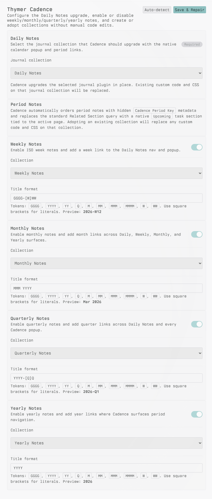
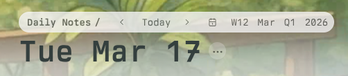
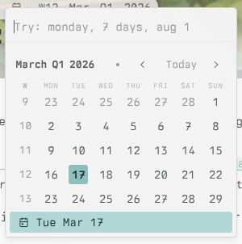

# Thymer Cadence

Thymer Cadence turns a standard `Daily Notes` journal into a cadence system with optional weekly, monthly, quarterly, and yearly notes. One global plugin, `Cadence Control`, handles setup, collection adoption or creation, runtime repair, and shared workspace settings.

Built for [Thymer](https://thymer.com/) with the [Thymer Plugin SDK](https://github.com/thymerapp/thymer-plugin-sdk).

## Screenshots

### Cadence Settings

### Daily Notes Nav

### Daily Notes Popup

## What It Does

- Upgrades the chosen `Daily Notes` journal in place
- Supports optional `Weekly Notes`, `Monthly Notes`, `Quarterly Notes`, and `Yearly Notes`
- Adds compact week, month, quarter, and year links to the Daily Notes top nav
- Extends the Daily Notes top calendar popup with week, month, quarter, and year links
- Creates new period collections or adopts existing ones from the settings panel
- Uses hidden `period_start` and `period_key` metadata for chronological ordering
- Drives a native `Upcoming` task section on period pages, scoped to the open record and carrying overdue tasks forward

## Commands

- `Cadence: Settings`
- `Cadence: Repair Workspace`

## Requirements

- One journal collection to use as `Daily Notes`

## Setup in Thymer

1. Open Thymer and go to `Plugins`.
2. Create or open the global plugin `Cadence Control`.
3. Paste `cadence-control/plugin.json` into **Configuration**.
4. Paste `cadence-control/plugin.js` into **Custom Code**.
5. Save the plugin.
6. Open Command Palette and run `Cadence: Settings`.
7. Pick your `Daily Notes` journal collection.
8. Turn weekly, monthly, quarterly, or yearly notes on or off.
9. For each period type that is on, choose an existing collection or create a new one.
10. Click `Save & Repair`.

`Cadence Control` manages the runtime code for `daily-note/` and `periodic-notes/`. End users do not install those runtime files by hand.

## How Cadence Works

- `Cadence Control` stores the shared workspace config and provisions managed collections
- `Daily Notes` keeps Thymer's journal flow and adds cadence links to the top nav and top date popup
- Period note collections share one runtime with period-specific `plugin.json` variants
- Period collections keep `period_start` and `period_key` hidden from the normal UI
- Period views sort by `period_key` in descending order
- Title formats use a small Moment-style token subset

## Title Format Tokens

- `GGGG`, `YYYY`, `YY`
- `M`, `MM`, `MMM`, `MMMM`
- `Q`
- `W`, `WW`
- Square brackets for literal text, such as `GGGG-[W]WW`

Examples:

- Weekly: `GGGG-[W]WW` -> `2026-W12`
- Monthly: `MMM YYYY` -> `Mar 2026`
- Quarterly: `YYYY-[Q]Q` -> `2026-Q1`
- Yearly: `YYYY` -> `2026`

## Repository Layout

- `cadence-control/` - global setup and repair plugin
- `daily-note/` - Daily Notes runtime source
- `periodic-notes/` - shared runtime source for weekly, monthly, quarterly, and yearly notes
- `screenshots/` - README images
- `scripts/build-control-plugin.mjs` - bundles the runtime sources into `cadence-control/plugin.js`
## License

No license file is present in this repo today.
